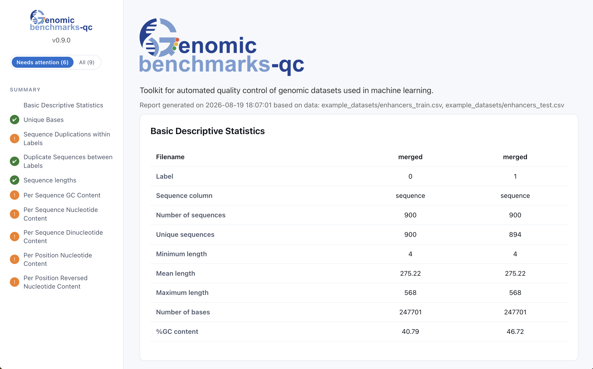

# { .hero-logo }

Find the shortcut. Learn the biology.
{ .tagline }

Automated quality control for genomic machine learning datasets: scores the
biases, duplicates and data leakage a classifier could exploit before you train
on it.

When the classes differ in something trivial, a high score no longer tells you
what a model learned — the biology, or the shortcut. `gb-qc` looks for the
differences a classifier could exploit without understanding anything: classes
that differ in length or base composition, a give-away at a single position, the
same sequence in both classes, a test set that repeats the training set.

```bash
pip install genomic-benchmarks-qc
```

```bash
gb-qc evaluate-classes \
  --input examples/enhancers/data/enhancers_train.csv \
  --input examples/enhancers/data/enhancers_test.csv \
  --out-folder qc-out
```

Every check gets a <span class="flag flag-pass">Pass</span>,
<span class="flag flag-warn">Warning</span> or
<span class="flag flag-fail">Fail</span> flag, a standalone HTML report you can
read or mail, and a CSV you can put in CI.

[{ .screenshot }](reports/enhancers/class/sequence/0_vs_1/gb-qc-report.html)

The report for [enhancers](examples/enhancers.md), one of the eight worked
examples below — **click it to open the real one.** Six of its nine checks want
attention, and the side nav filters down to just those. Everything is in the one
file: no server, no assets directory, nothing to host.

## Start here

<div class="grid cards" markdown>

-   **A flag fired. Now what?**

    [The checks](guide/checks.md) — what each one measures, and what to actually
    do about it. The page to read first.

-   **Why should I trust a flag?**

    [How a flag is decided](guide/how-it-works.md) — the single-feature AU-ROC,
    the 0.6 and 0.7 boundaries, and why
    <span class="flag flag-unknown">Unknown</span> is not
    <span class="flag flag-pass">Pass</span>.

-   **Show me it working**

    [Eight worked examples](examples/index.md) with live reports. Start with
    [hidden-motif](examples/hidden-motif.md), whose only flaw is six positions
    wide.

-   **Something is wrong**

    [Troubleshooting](faq.md) — MMseqs2 not found, everything came back
    `Unknown`, it is slow, the plot stops early.

</div>

## The examples

Eight datasets, each the only one that shows a particular thing, with flags
measured rather than asserted. They are the fastest way to see what a report
actually tells you — [start with the overview](examples/index.md), or go
straight to a report below.

| Example | What it shows | Report |
|---|---|---|
| [`clean-dataset`](examples/clean-dataset.md) | The control: what "nothing wrong" looks like, AU-ROC 0.50–0.54 throughout | [open](reports/clean-dataset/class/sequence/0_vs_1/gb-qc-report.html) |
| [`composition-bias`](examples/composition-bias.md) | The worst case — six checks fail, and 6% of the test set is already in training | [open](reports/composition-bias/class/sequence/0_vs_1/gb-qc-report.html) |
| [`hidden-motif`](examples/hidden-motif.md) | A bias six positions wide inside 398 positions. Why the per-position plot is interactive | [open](reports/hidden-motif/class/sequence/0_vs_1/gb-qc-report.html) |
| [`variable-length`](examples/variable-length.md) | Sequences that stop at different places, and why most positions go unscored | [open](reports/variable-length/class/sequence/0_vs_1/gb-qc-report.html) |
| [`length-bias`](examples/length-bias.md) | Length alone separating the classes, on a continuous label | [open](reports/length-bias/class/sequence/high_vs_low/gb-qc-report.html) |
| [`paired-sequences`](examples/paired-sequences.md) | Two sequence columns in one row | [open](reports/paired-sequences/class/merged/0_vs_1/gb-qc-report.html) |
| [`fasta-classes`](examples/fasta-classes.md) | One FASTA file per class | [open](reports/fasta-classes/class/sequence/coding_seqs_vs_intergenomic_seqs/gb-qc-report.html) |
| [`enhancers`](examples/enhancers.md) | The quickstart dataset, with a little real train/test leakage | [open](reports/enhancers/class/sequence/0_vs_1/gb-qc-report.html) |

Each has [a page of its own](examples/index.md) explaining what the dataset is,
the exact command, and what a reader should conclude. The data and its
provenance live in
[`examples/`](https://github.com/genomic-benchmarks/genomic-benchmarks-qc/tree/main/examples);
the reports are built from it by the same commands shown there, so what you read
is always what the current code produces.

## Flags

Flags come from the AU-ROC of a classifier that sees only the one feature under
test — see [how a flag is decided](guide/how-it-works.md) for why the boundaries
sit where they do:

| Flag | AU-ROC | Meaning |
|---|---|---|
| <span class="flag flag-pass">Pass</span> | ≤ 0.6 | Classes not distinguishable by this feature |
| <span class="flag flag-warn">Warning</span> | ≤ 0.7 | A model could get some traction here |
| <span class="flag flag-fail">Fail</span> | > 0.7 | Significant bias detected |
| <span class="flag flag-unknown">Unknown</span> | — | Not enough sequences to score the check |

<span class="flag flag-unknown">Unknown</span> is not
<span class="flag flag-pass">Pass</span>. It says the comparison was not made,
not that it came out clean — a check needs at least 250 sequences per class
before it is scored at all. The plots and descriptive statistics are computed
from all the data either way, so a small dataset can still be compared by eye.

## Also here

- [The per-position plot](guide/per-position.md) — it is interactive, and
  [one example](examples/hidden-motif.md) explains why it has to be
- [Train/test leakage](guide/leakage.md) — how similarity is measured, and what
  to do about it
- [Using it in CI](guide/ci.md) — the CSV as a build gate
- [Python API](guide/python-api.md) — both commands are one function call
- [Running at scale](guide/at-scale.md) — notes from a survey of 234 dataset
  splits
